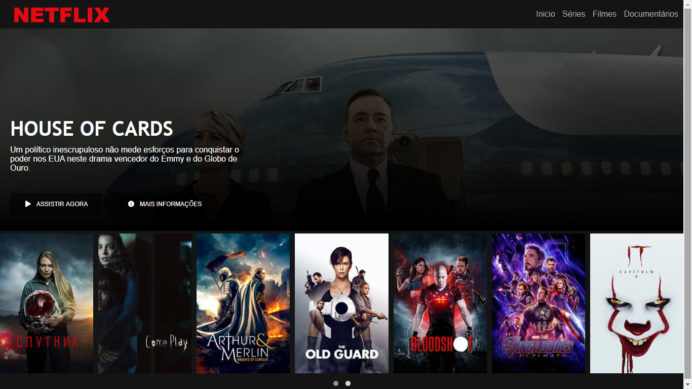

    

<h1 align="center">Netflix Clone</h1>

    Nesse projeto foi abordado os conceitos de flexbox responsive e também como utilizar plugins jQuery para criar um carrossel.

    

<h2 align = "center">Criado usando as tecnologias</h2>

